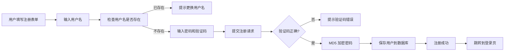
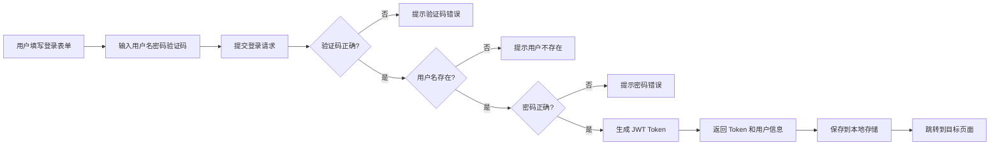
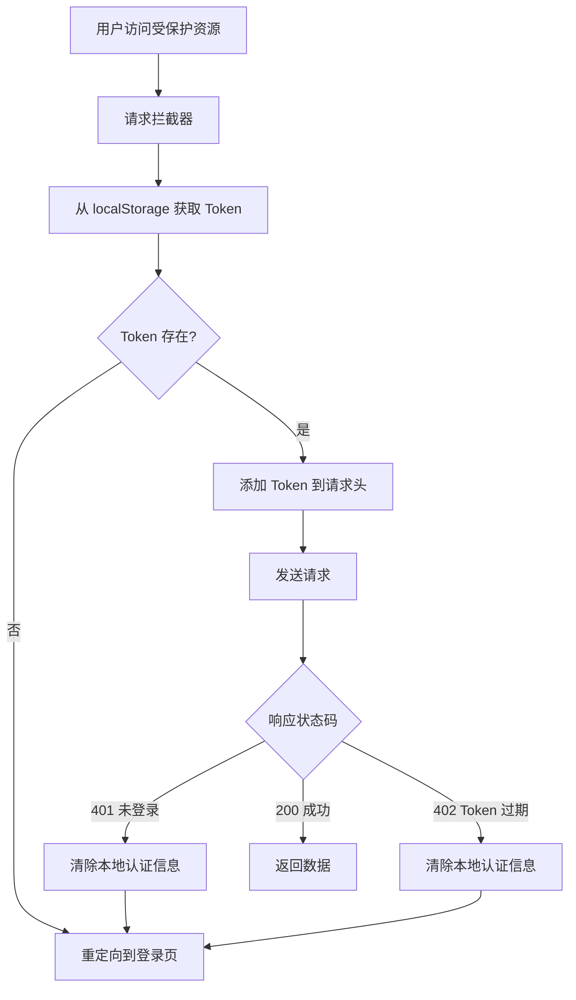

# 用户认证系统使用说明

## 📖 概述

本项目已实现完整的用户注册、登录、鉴权功能,基于 JWT Token 进行身份验证。

## 🎯 功能特性

- ✅ 用户注册(支持验证码)
- ✅ 用户登录(支持验证码)
- ✅ 用户登出
- ✅ Token 自动注入请求头
- ✅ Token 过期自动处理
- ✅ 路由守卫保护需要登录的页面
- ✅ 登录状态持久化
- ✅ 用户名查重

## 📁 新增文件说明

### 1. API 接口层
- `src/api/user.js` - 用户相关 API 接口封装

### 2. 状态管理层
- `src/store/modules/user.js` - Vuex 用户模块

### 3. 工具函数层
- `src/utils/auth.js` - Token 管理工具

### 4. 视图层
- `src/views/Login.vue` - 登录注册页面

### 5. 配置层
- `src/config/constants.js` - 新增认证相关常量

## 🔧 修改文件说明

### 1. 路由配置 (`src/router/index.js`)
- 新增 `/login` 路由
- 添加全局路由守卫
- 配置需要登录的路由

### 2. Axios 拦截器 (`src/axios.js`)
- 请求拦截器自动添加 Token 到请求头
- 响应拦截器处理未登录和 Token 过期情况

### 3. Vuex Store (`src/store/index.js`)
- 集成用户模块

### 4. Header 组件 (`src/views/Header.vue`)
- 显示登录/注册按钮(未登录时)
- 显示用户名和退出按钮(已登录时)

## 🚀 使用方法

### 访问受保护的页面

当前配置了以下页面需要登录才能访问:
- `/article-interview` - 面经页面

当用户访问这些页面时,如果未登录,会自动重定向到登录页,登录成功后会跳转回原本要访问的页面。

### 在路由中添加需要登录的页面

有两种方式:

#### 方式 1: 使用路由 meta 字段(推荐)

```javascript
{
  path: "/your-protected-page",
  name: "protectedPage",
  component: () => import("../views/YourPage.vue"),
  meta: { requiresAuth: true }  // 添加此配置
}
```

#### 方式 2: 在常量文件中配置

编辑 `src/config/constants.js`,在 `AUTH_REQUIRED_PATHS` 数组中添加路径:

```javascript
export const AUTH_REQUIRED_PATHS = [
  '/article-interview',
  '/your-protected-page'  // 添加新的路径
];
```

### 在组件中使用用户信息

```vue
<script setup>
import { computed } from 'vue'
import { useStore } from 'vuex'

const store = useStore()

// 获取用户信息
const userInfo = computed(() => store.getters['user/userInfo'])
const username = computed(() => store.getters['user/username'])
const isAuthenticated = computed(() => store.getters['user/isAuthenticated'])

// 调用登出方法
const handleLogout = async () => {
  await store.dispatch('user/logout')
}
</script>

<template>
  <div v-if="isAuthenticated">
    欢迎, {{ username }}!
  </div>
</template>
```

### 在 API 请求中自动携带 Token

所有通过 axios 发送的请求都会自动在请求头中携带 Token,无需手动处理:

```javascript
import axios from 'axios'

// Token 会自动添加到请求头
const response = await axios.get('/api/some-protected-resource')
```

## 📊 认证流程

### 注册流程



### 登录流程



### Token 验证流程



## 🔐 安全机制

### 1. 密码加密
- 前端传输明文密码(建议在生产环境中使用 HTTPS)
- 后端使用 MD5 加密存储

### 2. Token 管理
- JWT Token 有效期为 2 小时
- Token 存储在 localStorage 中
- 每次请求自动携带 Token
- Token 过期自动清除并跳转登录页

### 3. 验证码保护
- 注册和登录都需要输入验证码
- 验证码图片每次刷新都会更新
- 验证码存储在 Session 中

### 4. 路由守卫
- 全局路由守卫检查登录状态
- 支持路由级别和路径级别配置
- 登录后自动跳转回原页面

## 🎨 UI 说明

### 登录/注册页面
- 路径: `/login`
- 支持登录和注册两种模式切换
- 表单验证包括:
  - 用户名长度验证(3-20 字符)
  - 密码长度验证(最少 6 位)
  - 确认密码一致性验证(注册时)
  - 验证码长度验证(4 位)
  - 用户名查重(注册时)

### Header 组件
- 未登录状态: 显示"登录/注册"按钮
- 已登录状态: 显示用户名和"退出"按钮
- 退出时会有确认提示

## 🔍 常见问题

### 1. 如何修改 Token 过期时间?

Token 过期时间由后端控制,前端在 `src/config/constants.js` 中定义了 `TOKEN_EXPIRE_TIME` 常量用于参考,实际过期时间以后端 JWT 生成为准。

### 2. 如何添加更多需要登录的页面?

参考上文"在路由中添加需要登录的页面"章节。

### 3. 如何在组件中判断用户是否登录?

```javascript
import { useStore } from 'vuex'
const store = useStore()
const isAuthenticated = store.getters['user/isAuthenticated']
```

### 4. Token 过期后如何处理?

Token 过期后,axios 响应拦截器会自动:
1. 清除本地存储的 Token 和用户信息
2. 显示错误提示
3. 跳转到登录页

### 5. 如何自定义登录成功后的跳转逻辑?

在 `src/views/Login.vue` 的 `handleSubmit` 方法中修改:

```javascript
// 登录成功后
const redirect = route.query.redirect || '/index'  // 修改默认跳转路径
router.push(redirect)
```

## 📝 API 接口说明

### 用户相关接口

#### 1. 用户注册
```
POST /user/register
Request Body: { username, password, validCode }
Response: { code: 200, message: "注册成功", data: { id, username } }
```

#### 2. 用户登录
```
POST /user/doLogin
Request Body: { username, password, validCode }
Response: { 
  code: 200, 
  message: "登录成功", 
  data: { 
    id, 
    username, 
    avatar, 
    token 
  } 
}
```

#### 3. 用户登出
```
GET /user/logout
Headers: { token: "JWT_TOKEN" }
Response: { code: 200, message: "登出成功" }
```

#### 4. 检查用户名
```
GET /user/checkUsername?username=xxx
Response: { code: 200, data: 0|1 }  // 0=不存在, 1=存在
```

#### 5. 获取验证码
```
GET /user/getCheckCode
Response: image/png (Blob)
```

## 🎯 后续优化建议

1. **安全性增强**
   - 密码传输加密(RSA 或 HTTPS)
   - 添加图形验证码防机器人
   - 添加登录失败次数限制

2. **用户体验优化**
   - 记住密码功能
   - 自动登录功能
   - Token 自动续期
   - 多标签页登录状态同步

3. **功能扩展**
   - 找回密码功能
   - 邮箱/手机号验证
   - 第三方登录(微信、GitHub 等)
   - 用户个人中心

## 📚 相关文档

- [Vue Router 官方文档](https://router.vuejs.org/zh/)
- [Vuex 官方文档](https://vuex.vuejs.org/zh/)
- [Element Plus 文档](https://element-plus.org/zh-CN/)
- [JWT.io](https://jwt.io/)

---

**最后更新时间**: 2026-03-10
